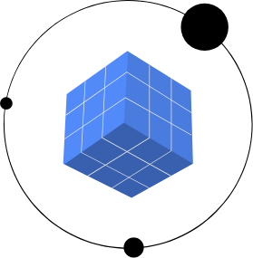
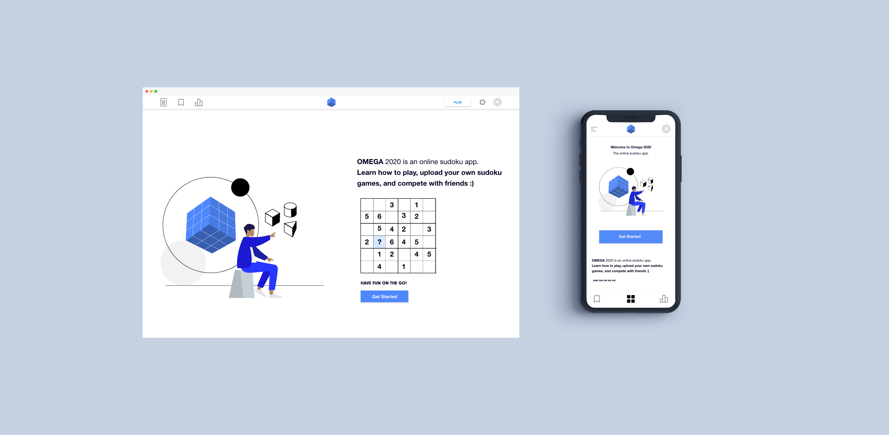

<h1 align="center"></h1>

<h1 align="center">Welcome to Omega 2020</h1>

The online sudoku Web iOS & Android App.

    

🛠 This is home to Omega 2020, an online sudoku app geared towards sudoku lovers and people who want to improve their sudoku skills. Learn how to play, upload your own sudoku games, and compete with friends :)

 

---

:desktop_computer: Deployed URL: _________________  

:iphone: App store and Google play URL: coming soon

---

## :desktop_computer:  [Web Repo](https://github.com/JessicaDosseh/Omega-Web-App.git)

## :iphone: [Web/iOS/Android Repo Bundle](https://github.com/JessicaDosseh/Omega-Bundle.git) 

> [Version 1 Repo](https://github.com/Lambda-School-Labs/omega2020-fe/tree/7510845175958d7fe47dc7c1204c9cd7cd181b54) 

---

## UX Prototype
:star: Link coming soon

<h1 align="center"></h1>

---

## INDEX

- [About Project](#Welcome-to-Omega-2020) 
- [Getting Started](#getting-started) 
    - [Project Set-Up](#project-set-up)
    - [How to run on multiple platforms](#how-to-run-on-multiple-platforms) 
- [Development Info](#development-info) 
    - [Tech Stack](#Tech-Stack)
    - [Contributors](#Contributors)
    - [How to Contribute](#How-to-Contribute)

This repo hosts:
- The [Omega 2020](#) frontend and server code
- A Web, Web-App, iOS, & Android development environment 

>  📂 For more information, read through our [DOCUMENTATION](https://github.com/JessicaDosseh/Omega-Bundle/tree/master/DOCUMENTATION)
>> [Project Vision Document - (PVD)](https://github.com/JessicaDosseh/Omega-Web-App/blob/master/DOCUMENTATION/0.0.1.DOCS/PVD.md)

>> [Usage](#)

>> [Design Specification](#)

>> [Trello Board](https://trello.com/b/NyKQYmbB/labs-pt11-omega2020)

>> [Product Canvas](https://www.notion.so/Omega2020-5f51e1cc70a64da5a15e222acabdc463)

---

# Getting Started

## Project Set Up

> To set up your expo workspace 
- [ ] Create a forked copy of this project.
- [ ] Clone your OWN version of the repository in your terminal. 
- [ ] `git pull` to make sure you are uptodate  
- [ ] `git checkout -b new-branch-name`
- [ ] Run `yarn` or `npm install`to install node_module.
- [ ] Run `expo install`
- [ ] Run `expo start` to start expo file. 

> To set up your web workspace 
- [ ] CD into `Omega-Web-App`
- [ ] Run `git submodule init` to initialize the submodule found in packages. 
- [ ] Run `git submodule update` to pull submodule files into your workspace. 
- [ ] Run `git checkout master`
- [ ] Run `git pull` to make sure all your files are up to date. 
- [ ] CD into `packages/web`
- [ ] Run `yarn` to install node_module.
- [ ] Run `yarn start` to start.

> For more information on [submodules](https://chrisjean.com/git-submodules-adding-using-removing-and-updating/) <- click

:rocket:  DO your magic! 

> Git flow cheat sheet

   - [ ] Push your work to your branch: `git add .` | `git commit -m '...'` | `git push origin your-branch-name`

## How to run on multiple platforms
 
## ——— To run your expo workspace
🚦 In the root folder: 

>> expo start to run the app with live reloading

     🔸 First run `expo start` then choose one of:
      -------------------------------------------------------------
     🔸  Scan the QR code with the Expo app (Android) or the Camera app (iOS).
     🔸  Press `a` for Android emulator, or `i` for iOS simulator, or `w` to run on web.
     🔸  Press `e` to send a link to your phone with email.
     🔸  Press `s` to sign in and enable more options.

>> yarn commands to run the app with live reloading, choose one of:

     🔸 `yarn web`
     🔸 `yarn ios`
     🔸 `yarn android`

## ——— To run your web workspace
🚦 In `Omega-Web-App/packages/web` run `yarn start` to run project

---

# Development Info

## [Tech Stack](#)

| FrontEnd  | BackEnd | Dependencies |
| ------ | ------ | ------ |
| React | NodeJS | Jest |
| React-Native | Postgres | Material UI |
| Expo | Express | bcrypt |
| Redux / Context API | SQL | jsonwebtoken |
| Axios | Knex | Find in pakcage.json files |

## [Testing](#)
## [API Documentation](#)

---

## Contributors

🙌 This project exists thanks to all the people who contribute. [[Contribute](#)].

> TL

| [Marvin Davila](https://github.com/#)  |
| :-------: |
|  |
|   |
|   |

> WEB

|  [Jessica Dosseh](https://github.com/JessicaDosseh)  |   [Alexis Anderson](https://github.com/#)  | [Carlos Turcios](https://github.com/#)  |  [Tara Sherman](https://github.com/#) | [Vincent Adeniji](https://github.com/#)  | 
|  :-------: | :-------: |  :-------: |  :-------: |  :-------: |  
|   |   |   |   |   |  
|    |   |   |   |   | 
|   |   |   |   |   |   | 

> DS

|[Stephen Plainte](https://github.com/#) | [Brandon Bruce](https://github.com/#) | [Ivan Santos](https://github.com/#) | [Daniel Aguilar](https://github.com/#) |
|  :-------: | :-------: |  :-------: |  :-------: |
|   |   |   |   |  
|    |   |   |   |
|   |   |   |   |   |

---

## 🤝 Contributing

Omega 2020 is a community project. We invite your participation through issues and pull requests! You can peruse the [contributing guidelines](#).

When adding or changing a service [please add tests](#).

This project has quite a backlog of suggestions! If you're new to the project, maybe you'd like to open a pull request to address one of them
